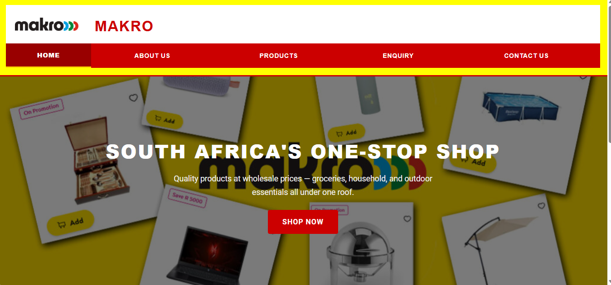
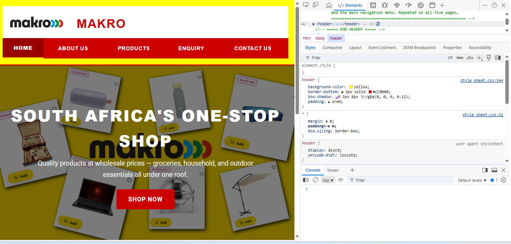
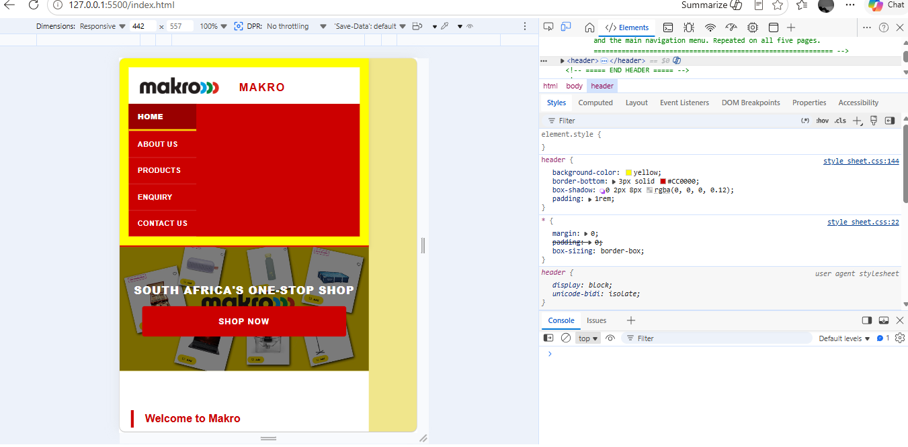

# Makro Website

## Student Information
| Field | Details |
|---|---|
| **Student Name** | [Palesa Dikolane] |
| **Student Number** | [St10528772] |
| **Module** | WEDE5020 — Web Development (Introduction) |
| **Institution** | The Independent Institute of Education (IIE) |
| **Group** | [Group03] |
| **Assessment** | POE — Part 1 (Foundation), Part 2 (CSS Styling), Part 3 (Functionality, SEO, Deployment) |

---

## Project Overview
This project involves designing and developing a professional five-page website for Makro, South Africa's leading warehouse retailer, which is part of the Massmart group. The website is built using HTML5, CSS, and embedded external services (Google Forms, Google Maps, YouTube, and Instagram). It is designed to give Makro a credible digital presence, showcase its product categories, allow customers to submit enquiries online, and provide branch location information.

---

## Website Goals and Objectives
- Increase Makro's digital visibility and brand awareness across South Africa
- Enable customers to browse product categories (Groceries, Household Items, Outdoor Items) online
- Provide clear contact information, trading hours, and six branch location maps
- Allow customers to submit product or service enquiries via an embedded Google Form
- Establish a professional, responsive website that works on desktop, tablet, and mobile devices

---

## Key Features
- Responsive design for desktop (1366px+), tablet (768px), and mobile (480px) screens
- Three product category sections with styled images and hover effects
- Native HTML enquiry and contact forms with client-side JavaScript validation (replacing the Part 2 Google Form embeds)
- Enquiry form processes input asynchronously (AJAX via the Fetch API) and displays a generated availability/pricing response
- Contact form compiles validated input into an email and opens it via a mailto: link addressed to Makro's customer care inbox
- Product search bar and category filter buttons (Groceries/Household/Outdoor) for instant client-side filtering
- Image gallery lightbox — click any product image for a full-screen view with keyboard and click navigation
- FAQ accordion with four expandable questions on the Products page
- Scroll-triggered fade-in animations on product and FAQ sections (IntersectionObserver)
- Interactive Leaflet.js map plotting all six branch locations, with a dropdown to fly to any branch
- Six embedded Google Maps showing Makro branch locations across South Africa
- Embedded YouTube video and Instagram reel on the Products page
- Consistent header (logo + brand name + red nav bar) and footer across all five pages
- Active page indicator on all navigation links
- CSS hover effects on navigation links, product images, and CTA buttons
- Google Fonts typography (Montserrat headings, Roboto body text)
- SEO meta description, meta keywords, descriptive image alt text, hyphenated image file names, robots.txt, and sitemap.xml on all five pages
- loading="lazy" applied to below-the-fold product images for improved page speed
- HTML comments explaining every section on all five pages
---

## Responsive Design Screenshots


### Desktop View (1366px+)

The full two-column intro grid, horizontal navigation bar, and 2-column branch map grid display at desktop width.

### Tablet View (768px)

The intro grid stacks to a single column, navigation font reduces, and maps stack to one column.

### Mobile View (480px)

The navigation collapses to a vertical list, hero image height reduces, and product images stack to a single column.

---

## Sitemap

```
Makro Website
├── Homepage          (index.html)
├── About Us          (about_us.html)
├── Products          (services_or_products.html)
├── Enquiry           (enquiry.html)
└── Contact Us        (contact_us.html)
```

All five pages are accessible directly from the main navigation bar on every page.

---

## File and Folder Structure

```
Makro/
├── index.html                        — Homepage
├── about_us.html                     — About Us page
├── services_or_products.html         — Products page
├── enquiry.html                      — Enquiry page (native form, Part 3)
├── contact_us.html                   — Contact Us page (native form + interactive map, Part 3)
├── robots.txt                        — Search engine crawl rules (Part 3)
├── sitemap.xml                       — XML sitemap of all five pages (Part 3)
├── README.md                         — This documentation file
├── css/
│   └── style_sheet.css               — Single external stylesheet for all pages
├── js/
│   ├── script.js                     — Products page: search/filter, lightbox, accordion, scroll animations (Part 3)
│   ├── forms.js                      — Enquiry + Contact form validation and submission handling (Part 3)
│   └── map.js                        — Leaflet.js interactive branch map (Part 3)
└── images/
    ├── makro_logo.png                — Makro brand logo
    ├── hero_image.jpeg               — Homepage hero banner
    ├── dairy_products.jpg            — Grocery: dairy
    ├── fruits_and_veggies.jpg        — Grocery: produce
    ├── frozen_foods.png              — Grocery: frozen
    ├── snacks_and_drinks.jpg         — Grocery: snacks
    ├── dry-goods.png                 — Grocery: dry goods (renamed from "dry goods.png" for SEO-friendly URLs)
    ├── kitchenware.jpg               — Household: kitchenware
    ├── containers.jpg                — Household: containers
    ├── cleaning-supplies.jpg         — Household: cleaning (renamed from "cleaning supplies.jpg" for SEO-friendly URLs)
    ├── camping_equipment.webp        — Outdoor: camping
    ├── outdoor_furniture.jpg         — Outdoor: furniture
    └── groceries_shopping_retail.jpg — Enquiry page background
```

---

## Deployed Website
The live website is accessible at: **https://st10528772.github.io/WEDE_5020/**

---

## Changelog

### Part 1 — April 2026
- Created full file and folder structure (css, images folders)
- Built semantic HTML5 structure for index.html (header-top flex row, nav, hero image, two-column intro, footer)
- Built semantic HTML5 structure for about_us.html (history, mission, vision, team sections)
- Built semantic HTML5 structure for services_or_products.html (three product category sections with images, lists, YouTube and Instagram embeds)
- Built semantic HTML5 structure for enquiry.html (embedded Google Form with grocery background)
- Built semantic HTML5 structure for contact_us.html (contact info, trading hours, Google Form, six Google Maps)
- Added navigation menu linking all five pages across all pages with active page highlighting
- Added descriptive HTML comments to all five pages explaining each section and each element
- Added alt text to all images across all five pages for accessibility
- Added SEO meta description and keywords to all five pages
- Added Google Maps iframes for six Makro branches (Woodmead, Centurion, Silver Lakes, Mpumalanga, Bloemfontein, Cape Gate)
- Embedded Google Form on enquiry.html and contact_us.html
- Embedded YouTube video and Instagram reel on services_or_products.html
- Created README.md with project overview, sitemap, file structure, and changelog

### Part 2 — May 2026
- Created css/style_sheet.css as a single external stylesheet linked to all five pages
- Imported Google Fonts: Montserrat (headings) and Roboto (body text) for a professional typographic hierarchy
- Applied CSS reset using the universal selector (*) to normalise default browser margins, padding, and box-sizing across all browsers
- Set body background to neutral light grey (#f4f4f4) and base text colour to near-black (#222222)
- Styled all heading levels (h1–h4) with the Montserrat font, Makro red (#CC0000), and appropriate size/weight hierarchy
- Restructured the header to use a flex row (.header-top) so the Makro logo and h1 sit side by side cleanly
- Styled the navigation bar with a full-width Makro red (#CC0000) background, white uppercase text, and smooth 0.25s hover transitions to a darker red (#990000)
- Added a gold (#FFD700) bottom border on the active navigation link to clearly indicate the current page
- Built the homepage hero section as a relative-positioned div with a full-width cover image and an absolutely positioned dark overlay; centred heading, tagline, and CTA button displayed using flexbox
- Created responsive two-column CSS Grid (.intro-grid) for homepage introduction cards with hover lift effect and left red border accent
- Styled the CTA button with Makro red background, white uppercase text, and a translateY(-2px) hover effect for interactivity
- Styled all product images (.style) with a red border, border-radius, box-shadow, and a scale(1.04) hover transform
- Wrapped product images in a flexbox .product-images row that wraps naturally on smaller screens
- Styled the contact info card (.contact-info-card) in Makro red with white text and gold accent headings
- Styled the response time notice (.response) as a highlighted left-border box for visual attention
- Built a two-column CSS Grid (.maps-grid) for branch location maps, each in a white card with a red header band
- Styled the enquiry page with a grocery store background image (background-attachment: fixed) and a white semi-transparent .form-card overlay for readability
- Styled the footer with a dark (#1a1a1a) background, light grey text, and a 4px red top border
- Implemented tablet responsive design at max-width 768px: intro-grid and maps-grid collapse to single column, heading sizes reduce, navigation font reduces to fit five links on one row
- Implemented mobile responsive design at max-width 480px: navigation stacks vertically, hero image height reduces, CTA button fills full width, product images stack to a single column
- Pushed all Part 2 changes to GitHub repository with descriptive commit messages

### Part 3 — June 2026
- Replaced the Google Form embed on enquiry.html with a native HTML form (text, email, tel, two select menus, textarea) including HTML5 and JavaScript validation
- Replaced the Google Form embed on contact_us.html with a native HTML form, validated client-side and submitted via a generated mailto: link addressed to Makro's customer care inbox
- Built js/forms.js: shared validation helpers (required fields, email regex, SA phone number regex, minimum message length), inline error messages, and aria-invalid attributes for accessibility
- Implemented AJAX form submission on the Enquiry form using the Fetch API (asynchronous POST request), followed by a dynamically generated response message reflecting the visitor's selected category and enquiry type
- Built js/script.js: product search bar and category filter buttons (Groceries/Household/Outdoor) that show/hide sections in real time without a page reload
- Added an image gallery lightbox to the Products page — clicking any product image opens a full-screen viewer with next/previous navigation, keyboard support (Escape/Arrow keys), and focus management for accessibility
- Added a four-question FAQ accordion section to the Products page using ARIA aria-expanded attributes for accessibility
- Added scroll-triggered fade-in animations to product and FAQ sections using the IntersectionObserver API
- Built js/map.js: an interactive Leaflet.js map (open-source, no API key) plotting all six branch locations as clickable markers with popups, plus a dropdown that flies the map to the selected branch
- Renamed images/cleaning supplies.jpg and images/dry goods.png to hyphenated file names (cleaning-supplies.jpg, dry-goods.png) for SEO-friendly URLs and updated all references
- Added loading="lazy" to all below-the-fold product images for improved page load speed
- Added robots.txt and sitemap.xml at the project root for search engine crawling and indexing
- Reviewed existing meta description, meta keyword, and image alt text coverage across all five pages (already in place from Part 1/2 and confirmed accurate for Part 3 SEO requirements)

---

## References

Google. (2024). *Google Fonts*. [Online] Available at: https://fonts.google.com [Accessed: 6 April 2026].

Google. (2024). *Google Maps Embed API*. [Online] Available at: https://developers.google.com/maps/documentation/embed/get-started [Accessed: 6 April 2026].

JSONPlaceholder. (2024). *Free Fake REST API for Testing and Prototyping*. [Online] Available at: https://jsonplaceholder.typicode.com [Accessed: 17 June 2026].

Leaflet. (2024). *Leaflet — an open-source JavaScript library for interactive maps*. [Online] Available at: https://leafletjs.com [Accessed: 17 June 2026].

Makro. (2024). *Makro South Africa — Official Website*. [Online] Available at: https://www.makro.co.za [Accessed: 6 April 2026].

Makro. (2024). *Makro store locations*. [Online] Available at: https://www.makro.co.za/stores [Accessed: 6 April 2026].

Massmart. (2024). *Massmart Holdings*. [Online] Available at: https://www.massmart.co.za [Accessed: 6 April 2026].

Mozilla Developer Network. (2024). *CSS: Cascading Style Sheets*. [Online] Available at: https://developer.mozilla.org/en-US/docs/Web/CSS [Accessed: 24 May 2026].

Mozilla Developer Network. (2024). *CSS Flexbox*. [Online] Available at: https://developer.mozilla.org/en-US/docs/Web/CSS/CSS_flexible_box_layout [Accessed: 24 May 2026].

Mozilla Developer Network. (2024). *CSS Grid Layout*. [Online] Available at: https://developer.mozilla.org/en-US/docs/Web/CSS/CSS_grid_layout [Accessed: 24 May 2026].

Mozilla Developer Network. (2024). *Fetch API*. [Online] Available at: https://developer.mozilla.org/en-US/docs/Web/API/Fetch_API [Accessed: 17 June 2026].

Mozilla Developer Network. (2024). *HTML: HyperText Markup Language*. [Online] Available at: https://developer.mozilla.org/en-US/docs/Web/HTML [Accessed: 6 April 2026].

Mozilla Developer Network. (2024). *HTML forms guide*. [Online] Available at: https://developer.mozilla.org/en-US/docs/Learn/Forms [Accessed: 17 June 2026].

Mozilla Developer Network. (2024). *IntersectionObserver API*. [Online] Available at: https://developer.mozilla.org/en-US/docs/Web/API/Intersection_Observer_API [Accessed: 17 June 2026].

Mozilla Developer Network. (2024). *mailto: URI scheme*. [Online] Available at: https://developer.mozilla.org/en-US/docs/Web/HTML/Reference/Elements/a#email_addresses [Accessed: 17 June 2026].

Mozilla Developer Network. (2024). *Using Media Queries*. [Online] Available at: https://developer.mozilla.org/en-US/docs/Web/CSS/CSS_media_queries/Using_media_queries [Accessed: 24 May 2026].

Pexels. (2024). *Free Stock Photos*. [Online] Available at: https://www.pexels.com [Accessed: 6 April 2026].

Google. (2024). *robots.txt and sitemap.xml — Search Central documentation*. [Online] Available at: https://developers.google.com/search/docs/crawling-indexing/robots/intro [Accessed: 17 June 2026].

Unsplash. (2024). *Free High-Resolution Photos*. [Online] Available at: https://unsplash.com [Accessed: 6 April 2026].

W3Schools. (2024). *CSS Flexbox*. [Online] Available at: https://www.w3schools.com/css/css3_flexbox.asp [Accessed: 24 May 2026].

W3Schools. (2024). *CSS Grid*. [Online] Available at: https://www.w3schools.com/css/css_grid.asp [Accessed: 24 May 2026].

W3Schools. (2024). *CSS Media Queries*. [Online] Available at: https://www.w3schools.com/css/css3_mediaqueries.asp [Accessed: 24 May 2026].

W3Schools. (2024). *HTML5 Semantic Elements*. [Online] Available at: https://www.w3schools.com/html/html5_semantic_elements.asp [Accessed: 6 April 2026].

W3Schools. (2024). *JavaScript Form Validation*. [Online] Available at: https://www.w3schools.com/js/js_validation.asp [Accessed: 17 June 2026].

W3Schools. (2024). *How To Create an Accordion*. [Online] Available at: https://www.w3schools.com/howto/howto_js_accordion.asp [Accessed: 17 June 2026].

W3Schools. (2024). *How To Create a Lightbox*. [Online] Available at: https://www.w3schools.com/howto/howto_css_lightbox.asp [Accessed: 17 June 2026].

Wikipedia. (2024). *Massmart*. [Online] Available at: https://en.wikipedia.org/wiki/Massmart [Accessed: 6 April 2026].

---
